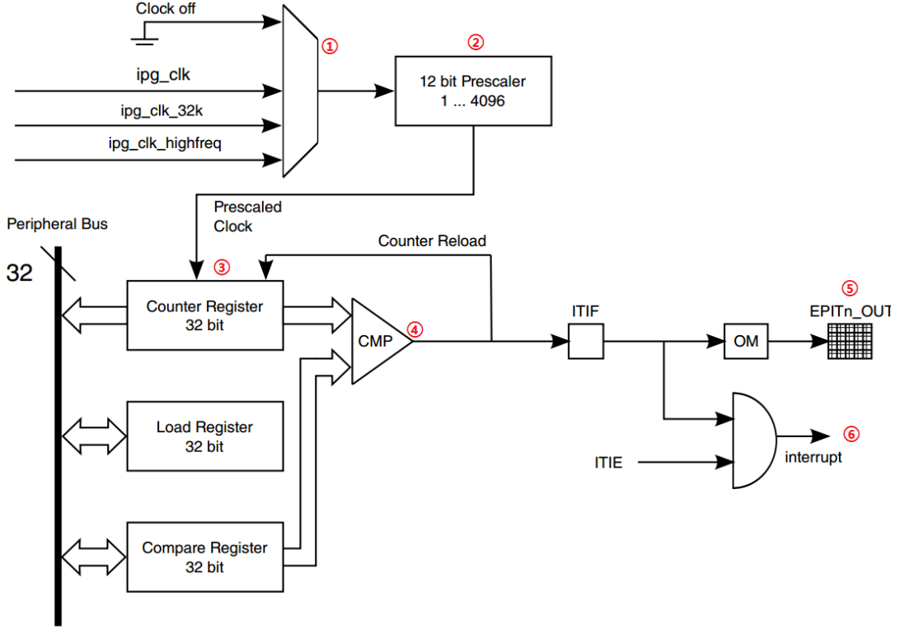

- - ## EPIT定时器实验
  
    EPIT 的全称是：Enhanced Periodic Interrupt Timer（增强的周期中断定时器）， 主要是完成周期性中断定时的。没有输入捕获与PWM功能。
  
    32位周期性中断。
  
    
  
    ①时钟源选择器
  
    ②12位分频器
  
    ③计数寄存器、比较寄存器、加载寄存器
  
    ④比较器
  
    **EPIT两种工作模式**
  
    - set-and-forgot:设置初始值
    - free-running：重头计数
  
    **EPIT 的配置步骤如下：** 
  
    1**、设置** EPIT1 **的时钟源**  设置寄存器 EPIT1_CR 寄存器的 CLKSRC(bit25:24)位，选择 EPIT1 的时钟源。  
  
    2**、设置分频值**  设置寄存器 EPIT1_CR 寄存器的 PRESCALAR(bit15:4)位，设置分频值。  
  
    3**、设置工作模式**  设置寄存器 EPIT1_CR 的 RLD(bit3)位，设置 EPTI1 的工作模式。  
  
    4**、设置计数器的初始值来源**  设置寄存器 EPIT1_CR 的 ENMOD(bit1)位，设置计数器的初始值来源。  
  
    5**、使能比较中断**  我们要使用到比较中断，因此需要设置寄存器 EPIT1_CR 的 OCIEN(bit2)位，使能比较中 断。  
  
    6**、设置加载值和比较值**  设置寄存器 EPIT1_LR 中的加载值和寄存器 EPIT1_CMPR 中的比较值，通过这两个寄存器 就可以决定定时器的中断周期。 
  
     7**、**EPIT1 **中断设置和中断服务函数编写**  使能 GIC 中对应的 EPIT1 中断，注册中断服务函数，如果需要的话还可以设置中断优先 级。最后编写中断服务函数。  
  
    8**、使能** EPIT1 **定时器**  配置好 EPIT1 以后就可以使能 EPIT1 了，通过寄存器 EPIT1_CR 的 EN(bit0)位来设置。  通过以上几步我们就配置好 EPIT 了，通过 EPIT 的比较中断来实现 LED0 的翻转。
