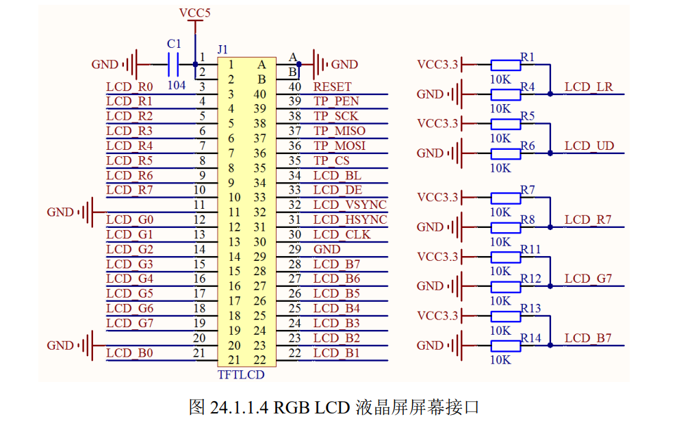
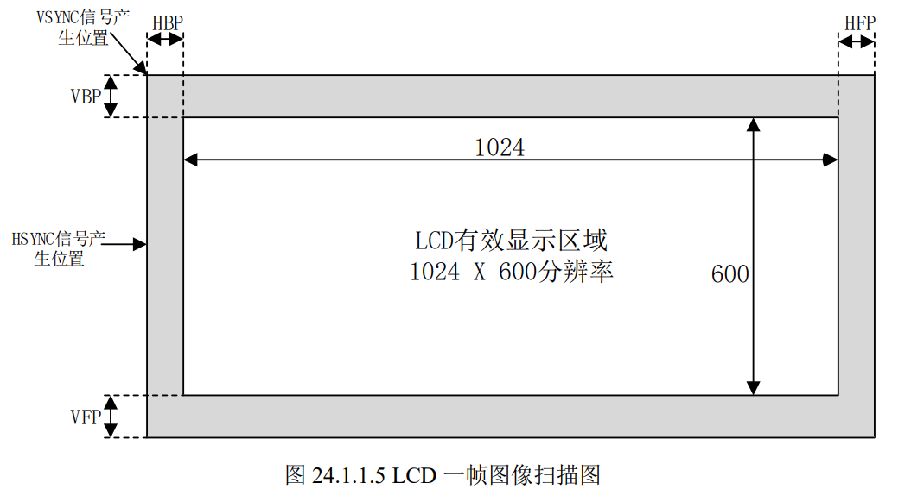
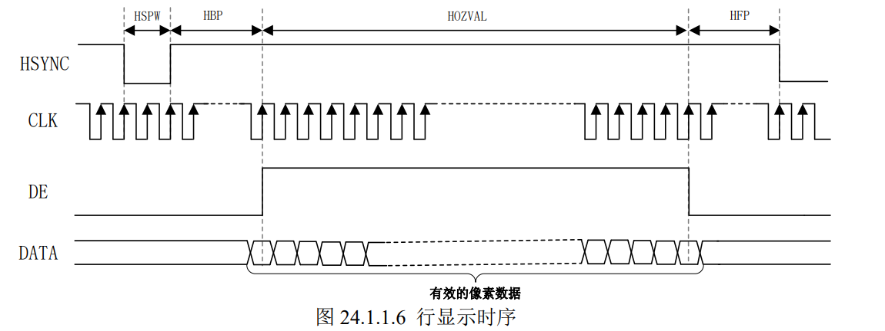
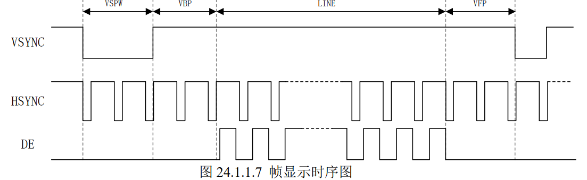
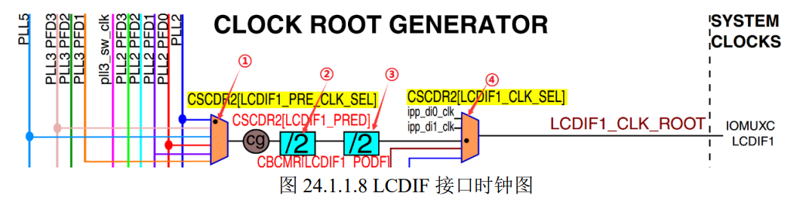
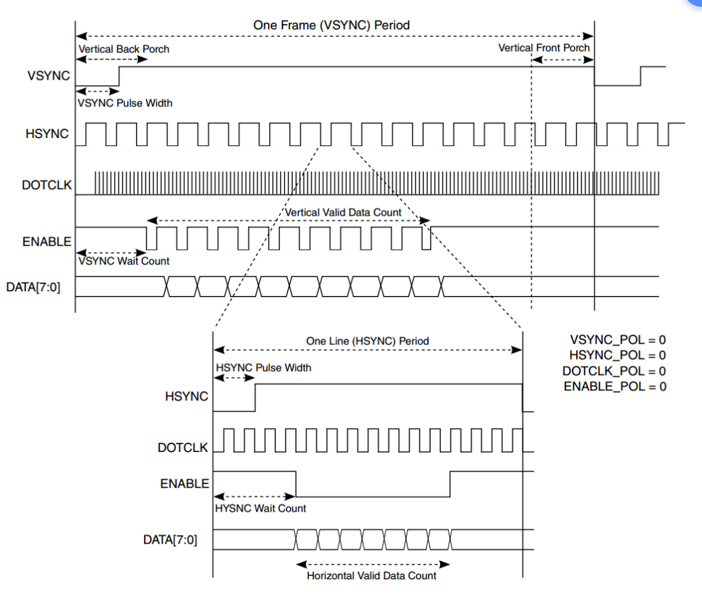
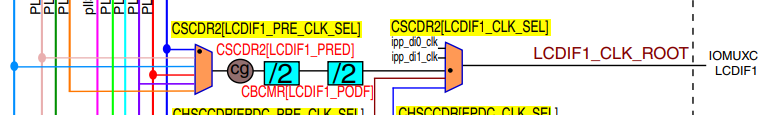

## RGBLCD

LCD 液晶屏是常用到的外设，通过 LCD 可以显示绚丽的图形、界面等，提高人机交互的效率。I.MX6U 提供了一个 eLCDIF 接口用于连接 RGB 接口的液晶屏。本章我们就学习如何驱动 RGB 接口液晶屏，并且在屏幕上显示字符。 

开发板使用的是RGB，4.3寸 （480x272） 7寸（800x480）

屏幕接口：MIPI、LVDS、MCU、RGB、VGA、HDMI、DP等

为什么要这么做？因为这个芯片支持这样的接口。

**正点原子屏幕ID**：使用ID可以识别出不同的屏幕，通过LCD屏幕上对特定引脚进行不同的上拉下拉电阻实现不同的ID。（R7,G7,B7）同时对显示效果没有影响。上电时首先读取ID值，然后匹配对应的初始化参数设置。这样就可以在一个例程里面**兼容不同的屏幕。**正点原子的阿尔法底板上，用了3个3157模拟开关。原因是防止LCD屏幕上的ID电阻影响到芯片的启动。

**LCD时间参数**

- 水平 
  - HSYNC信号，水平同步信号，行同步信号，当出现这个信号，表示新的一行开始显示。
    - 这个信号得维持一段时间——HSPW
  - HSYNC信号完成后，需要一段时间延时，HBP。
  - 有效区域显示完成以后，需要一段延时，HFP。等待下一个HSYNC。

- 垂直
  - VSYNC信号，垂直同步信号，帧同步信号，当出现这个信号，表示新的一帧开始显示。
    - 这个信号得维持一段时间——VSPW
  - VSYNC信号完成后，需要一段时间延时，VBP。
  - 所有的行显示完成以后，需要一段延时，VFP。等待下一个VSYNC。

**像素时钟**

一帧需要(VSPW+VBP+LINE+VFP) * (HSPW + HBP + HOZVAL + HFP) =853440个时钟数。

60帧算下来大约是51.2MHz。

**显存**

在讲像素格式的时候就已经说过了，如果采用 ARGB8888 格式的话一个像素需要 4 个字节的内存来存放像素数据，那么 1024x600 分辨率就需要 1024x600x4=2457600B≈2.4MB 内存。但 是 RGB LCD 内部是没有内存的，所以就**需要在开发板上的 DDR3 中分出一段内存作为 RGB  LCD 屏幕的显存**，我们如果要在屏幕上显示什么图像的话直接操作这部分显存即可。

直接定义一个32位数组。

**eLCDIF外设接口控制器**

eLCDIF 是 I.MX6U 自带的液晶屏幕接口，用于连接 RGB LCD 接口的屏幕

eLCDIF 支持三种接口：MPU 接口、VSYNC 接口和 DOTCLK 接口，这三种接口区别如下：

MPU:8080接口

VSYNC:比MPU多了帧同步

DOTCLK：RGB接口：也就是包括 **VSYNC、HSYNC、DOTCLK 和 ENABLE**(可选的)这四个信号

我们使用DOTCLK接口。

**相关重要寄存器**

- LCDIF_CTRL
  - bit0：使能位
  - bit1-bit3：选择16/18/24有效位
  - bit5：为 1 的话设置 eLCDIF 工作在主模式
  - bit8-9:输入数据格式，像素数据宽度；为 0 的话每个像素 16 位；为 1 的话每个像素 8 位；为 2 的话每个像素 18 位；为 3 的话每个像素 24 位。
  - bit10-11：LCD数据总线宽度；为 0 的话总线宽度为 16 位；为 1 的话总线宽度为 8 位；为 2 的话总线宽度为 18 位；为 3 的话总线宽度为 24 位。
  - bit12-13：CSC字节交换设置。
  - bit14-15：输入端字节交换设置；此位为 0 是小端模式；为 1 是大端模式；为 2 的话半字交换；为 3 的话在每个半字内进行字节交换。
  - bit17:DOTCLOK模式
  - bit18：VSYNC模式
  - bit31:软复位
- LCDIF_CTRL1(决定32位数据中的那些字节的数据有效)
  - 24位（ARGB）
- LCDIF_TRANSFER_COUNT（设置分辨率）
- LCDIF_VDCTRL0(是 VSYNC 和 DOTCLK 模式控制寄存器 0)
  - bit17:0:VSPW
  - bit20:VSYNC 信号脉冲宽度单位
  - bit21:VSYNC 信号周期单位
  - bit24:EANBLE 数据线极性设置位
  - bit25:DOTCLK 数据线(像素时钟线 CLK) 极性设置位，为 0 的话下降沿锁存数据，上升沿捕获数据，为 1 的话相反，要根据所使用的 LCD 数据手册来设置。
  - bit26:HSYNC 数据线极性设置位，为 0 的话 HSYNC 低电平有效，为 1 的 话 HSYNC 高电平有效，要根据所使用的 LCD 数据手册来设置。
  - bit27:VSYNC 数据线极性设置位，为 0 的话 VSYNC 低电平有效，为 1 的 话 VSYNC 高电平有效，要根据所使用的 LCD 数据手册来设置。 
  - bit28:EBABLE 数据线使能位，也就是 DE 数据线。为 1 的话使能 ENABLE 数据线，为 0 的话关闭 ENABLE 数据线。 
  - bit29:VSYNC 信号方向控制位，为 0 的话 VSYNC 是输出，为 1 的话 VSYNC 是输入。
- LCDIF_VDCTRL1(用来设置 VSYNC 总周期，屏幕高度+VSPW+VBP+VFP)
- LCDIF_VDCTRL2(设置HSPW,与HSYNC 总周期，就是：屏幕宽度+HSPW+HBP+HFP)
- LCDIF_VDCTRL3
  - bit15:0:用于 VSYNC 信号，也就是 VSPW+VBP
  - bit27:16:此位用于 DOTCLK 模式，用于设置 HSYNC 信号产生到有效数据产生之间的时间，也就是 HSPW+HBP。 
- LCDIF_VDCTRL4
  - bit15:0:设置 LCD 的宽度，也就是水平像素数量
  - bit18:同步信号使能位，设置为 1 的话使能 VSYNC、HSYNC、 DOTCLK 这些信号。
- LCDIF_CUR_BUF 和 LCDIF_NEXT_BUF(分别为当前帧和下一帧缓冲区，也就是 LCD 显存。一般这两个寄存器保存同一个地址，也就是划分给 LCD 的显存首地址。)

**配置步骤**

1**、初始化** LCD **所使用的** IO  首先肯定是初始化 LCD 所示使用的 IO，将其复用为 eLCDIF 接口 IO。  

2**、设置** LCD **的像素时钟**  查阅所使用的 LCD 屏幕数据手册，或者自己计算出的时钟像素，然后设置 CCM 相应的寄存器。  

3**、配置** eLCDIF **接口**  设置 LCDIF 的寄存器 CTRL、CTRL1、TRANSFER_COUNT、VDCTRL0~4、CUR_BUF 和 NEXT_BUF。根据 LCD 的数据手册设置相应的参数。  

4**、编写** API **函数**  驱动 LCD 屏幕的目的就是显示内容，所以需要编写一些基本的 API 函数，比如画点、画 线、画圆函数，字符串显示函数等。 

**使用资源**

①、指示灯 LED0。  

②、RGB LCD 接口。 

③、DDR3  

④、eLCDIF 

**LCD像素时钟的设置**

LCD需要一个CLK信号，如何产生？

比如7寸1024x600的屏幕需要51.2MHz的像素时钟。

- 来源：PLL5

