## 主频与时钟配置实验

bootroom默认配置成396MHZ

**系统时钟来源：**

- 32.768KHz，供给RTC使用。不会参与系统时钟

- 24MHz（T16\T17引脚），供给系统时钟

从24MHz生成其他模块需要的时钟——7路PLL倍频时钟源，7路每一路有的又生成PFD

  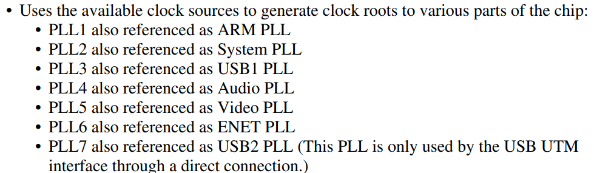

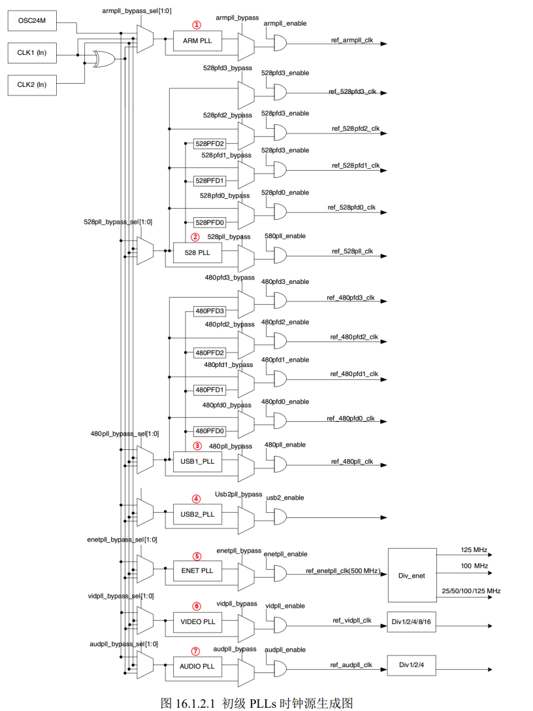

1. ARM_PLL,供给内核使用，最高可倍频1.3GHz
2. 528_PLL，系统固定22倍频，不可编程修改，分成四路PFD，共同作为很多外设的根时钟源。通常这五路是系统内部总线的时钟源。比如逻辑处理单元、DDR接口等。
3. USB1_PLL，主要用于USBPHY（也可用作其他外设根时钟源），也有四路PFD，固定20倍频-480MHz。
4. USB2_PLL，相同
5. ENET_PLL，用于生成网络所需要的时钟。
6. VIDEO_PLL，显示相关的外设
7. AUDIO_PLL,音频相关外设

**时钟树简介**

板子上的所有外设都是从这7路PLL中来的。但是究竟如何选择呢？

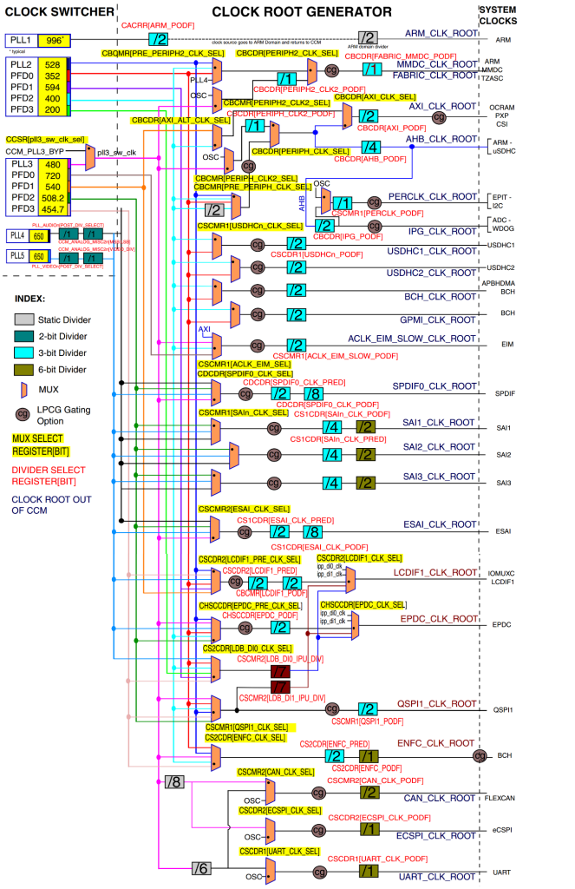

分为三部分CLOCK_SWITCHER、CLOCK ROOT GENERATOR 和 SYSTEM CLOCKS。

外设时钟源是有多路可以选择的，CLOCK ROOT GENERATOR 就负责从 7 路 PLL 和 8 路 PFD 中选择合适的时钟源给外设使用。（具体操作还是要修改寄存器）

例如：ESAI有四个时钟源可以选择：PLL4/PLL5/PLL3_PFD2/PLL3_SW_CLK

**要初始化的PLL与PFD**

- PLL1，内核使用
- PLL2/对应4个PFD，系统使用
- PLL3/对应的4个PFD
- 其他的可以在用到再设置

一般按照时钟树里面的值进行设置。

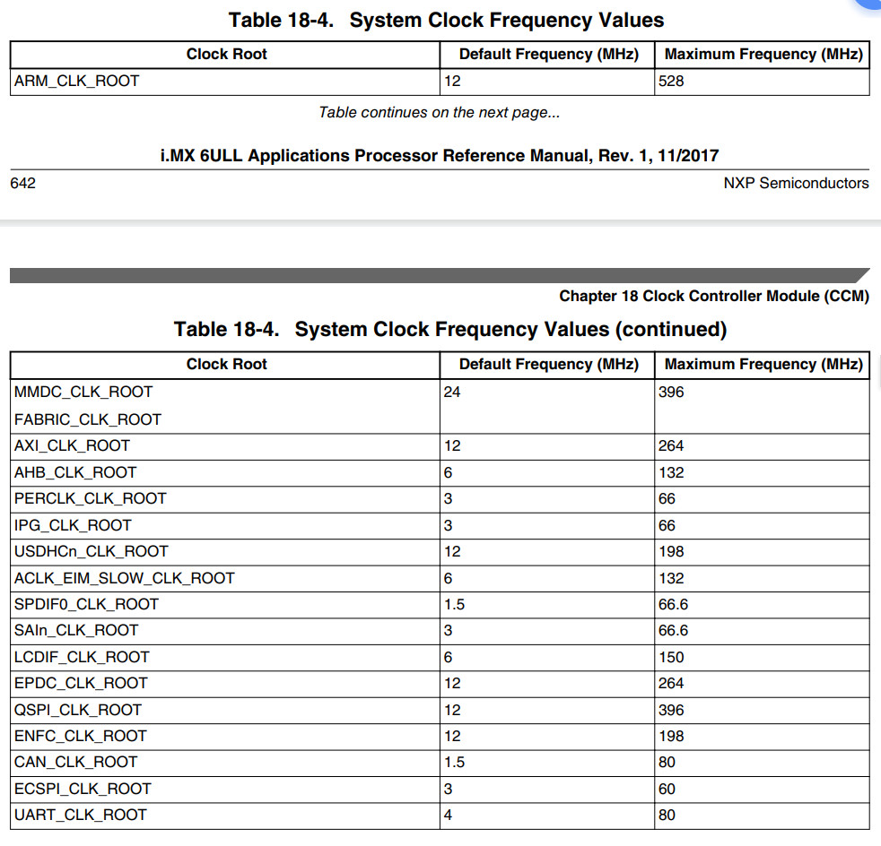

**系统时钟配置**

**1.主频配置**

原理分析完之后，就可以开始设置相应的时钟频率了。先从主频开始，我们将 I.MX6U 的主频设置为 528MHz

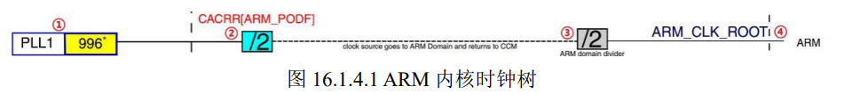

996分频得到ARM主频。

若默认是528MHz的话，PLL1就需要1056MHz（二分频）

792MHz,需要PLL1792MHz（一分频）

①分频是由CACRR这个寄存器控制的。可以设置1-8分频。

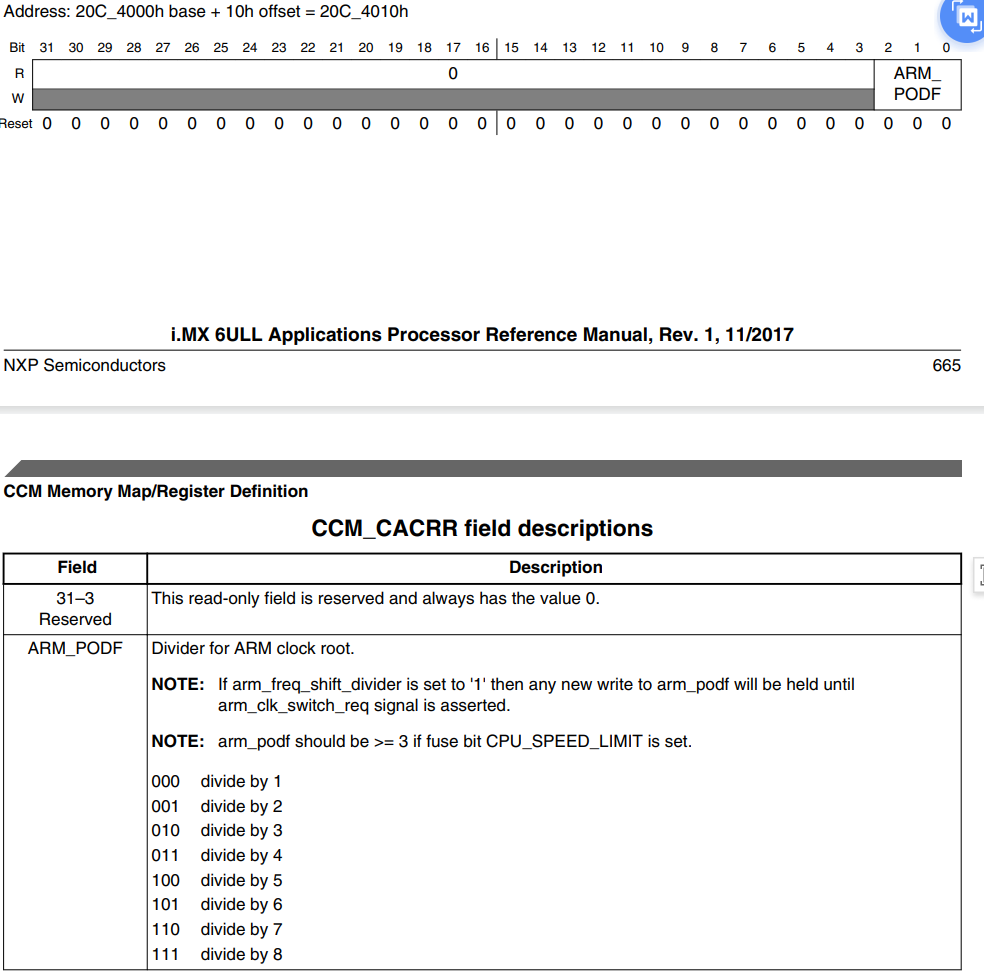

二分频应该设置CACRR寄存器的ARM_PODF等于1.

②设置PLL1的频率，PLL1=PLL1_SW_CLK

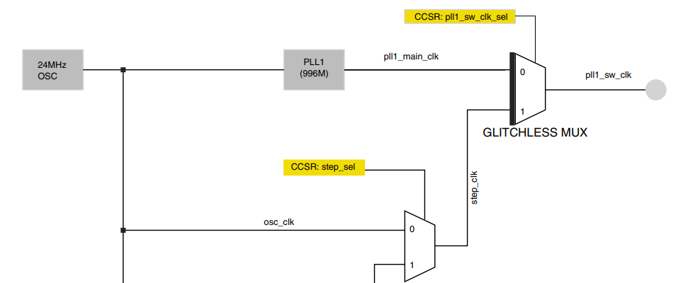

可以看出，PLL1_SW_clk，通过由两路可以选择，分别为PLL1_MAIN_CLK和STEP_CLK。通过CCSR控制。

③在修改PLL1，也就是修改系统时钟时，需要给6ull、一个临时的时钟。（也就是step_clk）在修改pll1时，需要将时钟切换到step_clk上面。等调整好了再切换回来。

④时钟切换成功以后，就可以修改pll的值。

寄存器CCM_ANALOG_PLL_ARMn

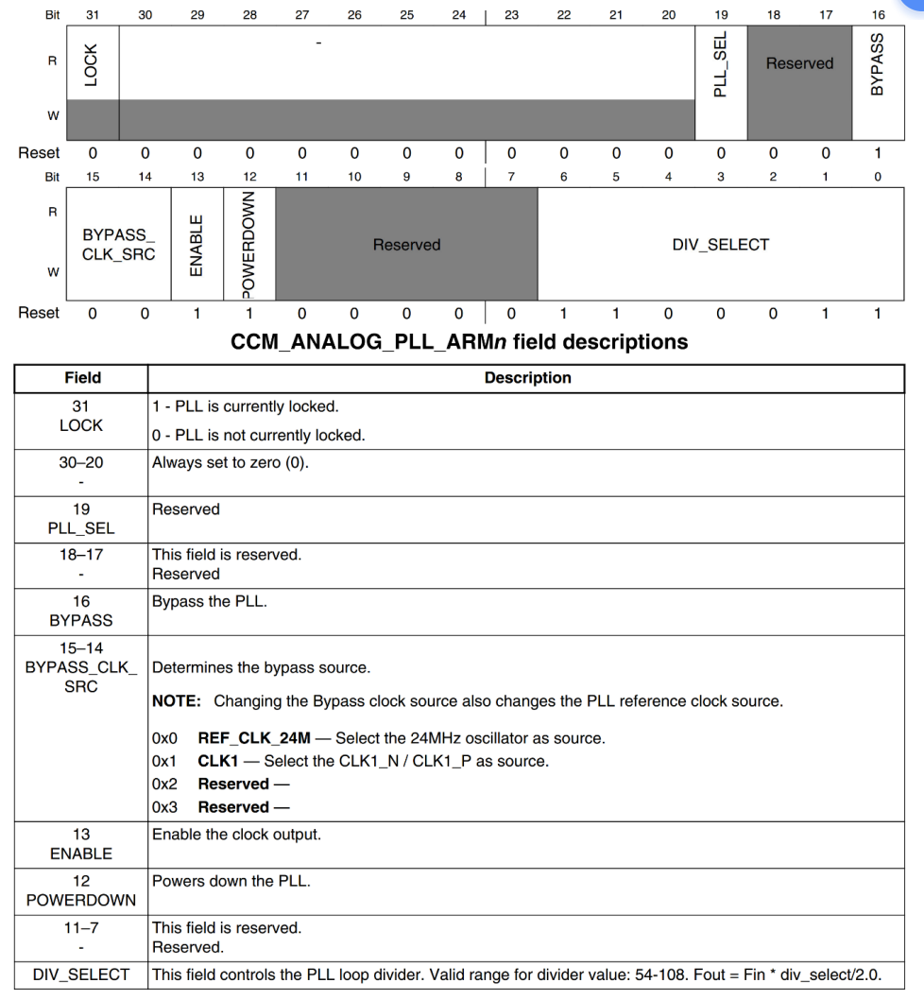

Fout = Fin * div_select/2.0.

1056 = 24*DIV/2      ->DIV=88即可

⑤在切换回PLL1之前，设置CACRR寄存器的ARM_PODF=1!进行二分频至528M

**2.其他pll与PFD设置**

pll2与pll3

pll2固定为528MHZ，pll3固定为480MHz，这个pll已经在bootrom设置好了，我们不需要改。接下来设置四路PFD

①初始化pll2_pfd0~pfd3四路。寄存器CCM_ANALOGS_528用于设置PFD时钟。

而PFD0= 528*18/PFD0_FRAC(参考手册表中有)，则设置PFD0_FRAC即可。

②初始化pll3_pfd0~pfd3四路

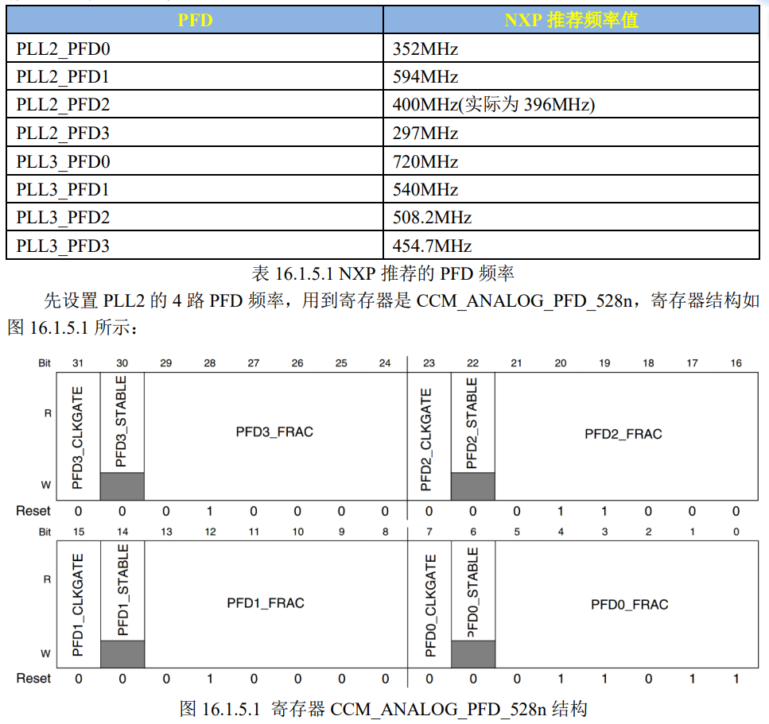

**3.其他外设时钟源配置**

AHB_CLK_ROOT,PERCLK_CLK_ROOT以及IPG_CLK_ROOT

因为后两个要用到AHB_CLK_ROOT，而后面两个又连了很多重要外设。

①AHB_CLK_ROOT初始化。设置为132MHZ

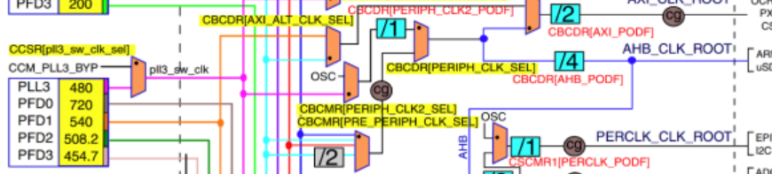

- 设置CBCMR寄存器的PRE_PERIPH_ CLK_SEL位为01，选择时钟源
- 设置CBCDR寄存器的PERIPH_CLK_ SEL为0，选择PLL2
- 设置CBCDR寄存器的AHB_PODF位，选择三分频

②PERCLK_CLK_ROOT初始化，66MHZ

③IPG_CLK_ROOT初始化，66MHZ

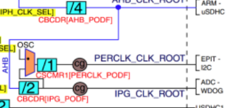

