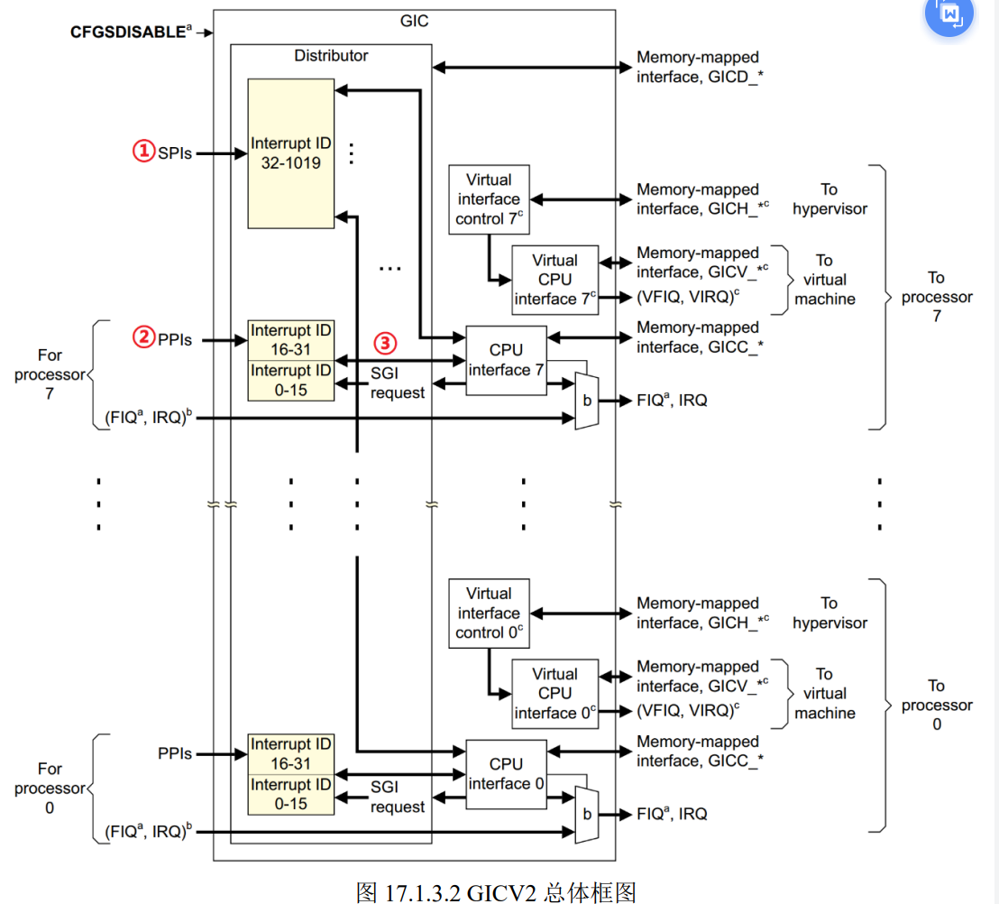

## GPIO中断实验

中断系统是一个处理器重要的组成部分，中断系统极大的提高了 CPU 的执行效率。本章会将 I.MX6U 的一个 IO 作为输入中断，借此来讲解如何对 I.MX6U 的中断系统进行编程。

**Cortex-A7中断系统**

cortex-a7内核有8个异常中断。中断向量表如下：


重点是IRQ，Cortex-A 内核 CPU 的**所有外部中断都属于这个 IRQ 中断**，当任意一个外部中断发生的时候都会触发 IRQ 中断。在 IRQ 中断服务函数里面就可以读取指定的寄存器来判断发生的具体是什么中断，进而根据具体的中断做出相应的处理。

- 需要设置中断向量偏移到指定寄存器。

**GIC控制器**

- GIC中断控制器，用于管理cortex-A的中断。提供了开关中断、设置中断优先级等工作。
  - 目前 GIC 有 4 个版本:V1~V4，V1 是最老的版本，已经被废弃了。V2~V4 目前正在大 量的使用。GIC V2 是给 ARMv7-A 架构使用的，比如 Cortex-A7、Cortex-A9、Cortex-A15 等， V3 和 V4 是给 ARMv8-A/R 架构使用的，也就是 64 位芯片使用的。




左侧部分就是中断源，中间部分就是 GIC 控制器，最右侧就是中断控制器向处理器内核发送中断信息。GIC中断源分为**SPI（共享中断）PPI(私有中断)SGI（软件中断）**

- SPI:所有 Core 共享的中断，这个是最 常见的，那些外部中断都属于 SPI 中断,这些中断所有的 Core 都可以处理，不限定特定 Core。 
- PPI:GIC 是支持多核的，每个核肯定有自己独有的中断。这些独有的中断肯定是要指定的核心处理，因此这些中断就叫做私有中断。
- SGI:由软件触发引起的中断，通过向寄存器 GICD_SGIR 写入数据来触发，系统会使用 SGI 中断来完成多核之间的通信。

**中断ID**

区分中断源，每一个CPU最多支持1020个中断ID，中断 ID 号为 ID0~ID1019。

- ID0~ID15：这 16 个 ID 分配给 SGI。  

- ID16~ID31：这 16 个 ID 分配给 PPI。 

- ID32~ID1019：这 988 个 ID 分配给 SPI。像 GPIO 中断、串口中断等这些外部中断 ，至于具体到某个 ID 对应哪个中断那就由半导体厂商根据实际情况去定义了。

比如 **I.MX6U 的总共使用了 128 个中断 ID**，加上前面属于 PPI 和 SGI 的 32 个 ID，I.MX6U 的中断源共有 128+32=160 个。


中断ID有什么用，对于所有外部中断，触发的只有IRQ，所以要从IRQ的终端服务函数中获取当前中断号，再找到对应的中断处理函数就可以了。

两个服务函数：

- IRQ中断服务函数
- 外设终端服务函数

**GIC逻辑分块**

GIC 架构分为了两个逻辑块：Distributor 和 CPU Interface，也就是分发器端和 CPU 接口端。

- 分发器端：此逻辑块负责处理各个中断事件的分发问 题，也就是中断事件应该发送到哪个 CPU Interface 上去。分发器收集所有的中断源，可以控制 每个中断的优先级，它总是将优先级最高的中断事件发送到 CPU 接口端。
- CPU接口端：和 CPU Core 相连接的。每个 CPU Core 都可以在 GIC 中找到一个与之对应的 CPU Interface。CPU 接口端 就是分发器和 CPU Core 之间的桥梁。

**修改start.s**

- 添加中断向量表与中断服务函数

```c
_start:
    ldr pc, =Reset_Handler		/* 复位中断 					*/	
	ldr pc, =Undefined_Handler	/* 未定义中断 					*/
	ldr pc, =SVC_Handler		/* SVC(Supervisor)中断 		*/
	ldr pc, =PrefAbort_Handler	/* 预取终止中断 					*/
	ldr pc, =DataAbort_Handler	/* 数据终止中断 					*/
	ldr	pc, =NotUsed_Handler	/* 未使用中断					*/
	ldr pc, =IRQ_Handler		/* IRQ中断 					*/
	ldr pc, =FIQ_Handler		/* FIQ(快速中断)未定义中断 			*/

/*复位中断服务函数 */
Reset_Handler:
    ldr r0, =Reset_Handler
    bx r0

/* 未定义中断 */
Undefined_Handler:
	ldr r0, =Undefined_Handler
	bx r0

/* SVC中断 */
SVC_Handler:
	ldr r0, =SVC_Handler
	bx r0

/* 预取终止中断 */
PrefAbort_Handler:
	ldr r0, =PrefAbort_Handler	
	bx r0

/* 数据终止中断 */
DataAbort_Handler:
	ldr r0, =DataAbort_Handler
	bx r0

/* 未使用的中断 */
NotUsed_Handler:
	ldr r0, =NotUsed_Handler
	bx r0

/* IRQ中断 */
IRQ_Handler:
    ldr r0, =IRQ_Handler
	bx r0

/* FIQ中断 */
FIQ_Handler:
	ldr r0, =FIQ_Handler	
	bx r0	
```

- 编写复位中断服务函数
  - 关闭ICache、DCache、MMU
  - 设置处理器9种工作模式下对应的SP指针（因为不同模式下都有自己独立的SP指针）。要使用中断需要进入中断IRQ模式，需要设置IRQ下的SP指针，索性直接设置所有模式下的指针。
  - 清除bss段
  - 跳到main函数

**CP15协处理器**

CP15寄存器，CP15 协处理器一般用于存储系统管理，但是在中断中也会使用到，CP15 协处理器一共有 16 个 32 位寄存器。

MRC: 将 CP15 协处理器中的寄存器数据读到 ARM 寄存器中。  

MCR: 将 ARM 寄存器的数据写入到 CP15 协处理器寄存器中。

```
指令格式：MCR{cond} p15, <opc1>, <Rt>, <CRn>, <CRm>, <opc2> 
cond:指令执行的条件码，如果忽略的话就表示无条件执行。 
opc1：协处理器要执行的操作码。 
Rt：ARM 源寄存器，要写入到 CP15 寄存器的数据就保存在此寄存器中。 
CRn：CP15 协处理器的目标寄存器。 
CRm：协处理器中附加的目标寄存器或者源操作数寄存器，如果不需要附加信息就将
CRm 设置为 C0，否则结果不可预测。 
opc2：可选的协处理器特定操作码，当不需要的时候要设置为 0。
```

**GPIO驱动文件**

前面的试验中我们只是使用到了 GPIO 最基本的输入输出功能，本章我们需要使用 GPIO 的中断功能。所以需要修改文件 GPIO 的驱动文件 bsp_gpio.c 和 bsp_gpio.h，加上中断相关函数。

- GPIO中断触发方式（GPIO_ICR）
  - 低电平、高电平、上升沿、下降沿。
- 使能GPIO对应的中断，设置GPIO_IMR寄存器
- 处理完中断之后，需要清除中断标志位，也就是清除GPIO_ISR寄存器相应的位置。（写1清零）
- 配置GIC
  - 使能中断ID
  - 设置中断优先级
  - 注册GPIO中断处理函数
